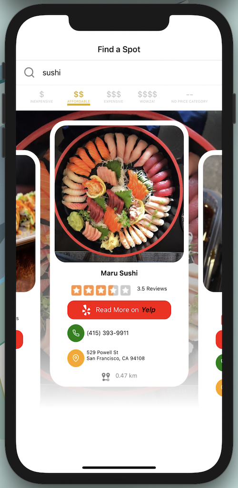
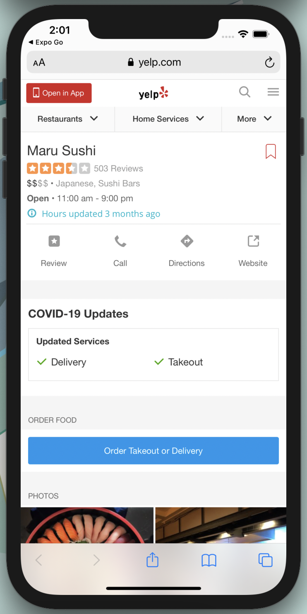

# Find a Spot 
This application lists services or businesses close to your location based on the search criteria.  

This example is the result of 'cake' and the affordable tab is selected :

(https://github.com/MariekieCoetzee/FindASpot/blob/master/src/images/FindASpot.gif)
Simply search for a service, food craving or business.  The results will be returned in a beautiful animated ui grouped by affordability.

More information will be displayed in a browser when taping on the 'Read more on *Yelp*' button.

Spot on map locations will be reveiled  when tapping on the maps icon.

Contacting on the spot could not be easier, simply click on the phone icon or number and the dialer will be pre populated with the number.

# About 'Find a Spot'

This application developed with the React Native framework.

[Yelp API](http://www.yelp.com) is used for the search platform.

# Credits
Inspired by a Udemy course *[The Complete React Native + Hooks Course 2020 Edition - Stephen Grider](https://www.udemy.com/course/the-complete-react-native-and-redux-course/)*  and [Catalin Miron fantastic videos](https://www.youtube.com/channel/UCTcH04SRuyedaSuuQVeAcdg)
